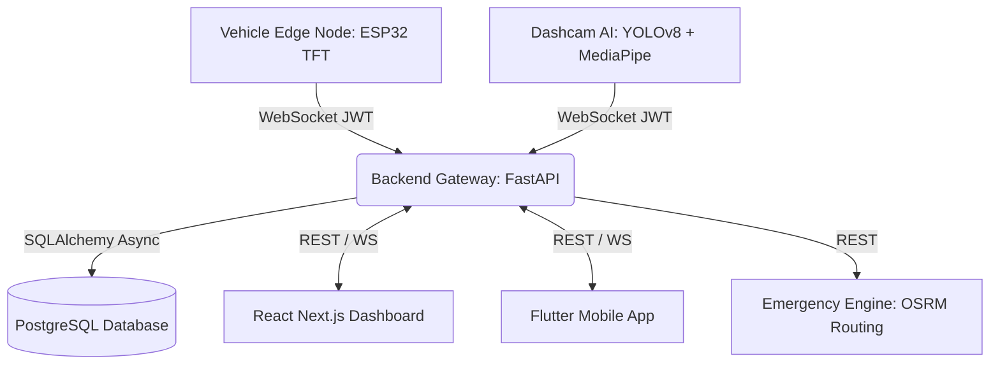
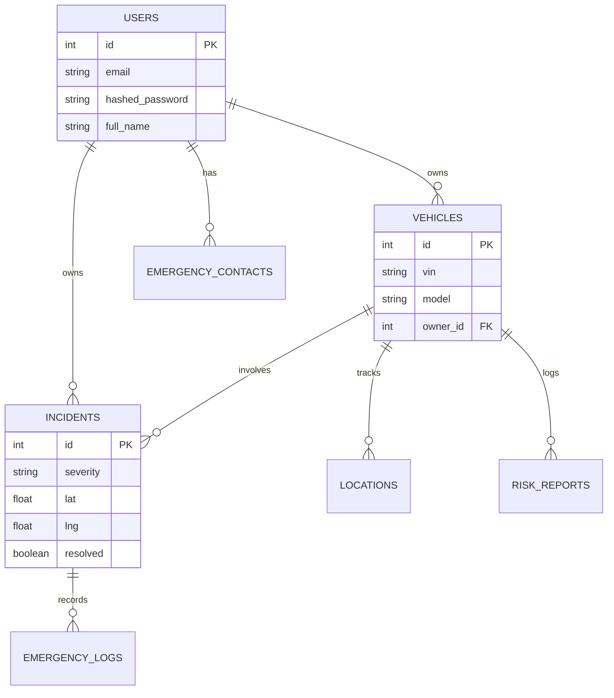

# RoadSoS X: Intelligent Mobility Platform 🚀

**An AI-powered vehicle safety, accident prediction, and autonomous emergency response platform.**

## 🌟 Overview
RoadSoS X is an enterprise-grade ecosystem that integrates Edge AI, real-time telemetry, emergency routing, and multi-platform interfaces to ensure driver safety and automate emergency response. 

## 🏗️ Architecture



## 📦 System Components

1. **AI Vision Engine** (`/ai-vision`): Python, OpenCV, YOLOv8 (Object/Lane detection), MediaPipe (Drowsiness).
2. **Backend Gateway** (`/backend-gateway`): FastAPI, JWT Auth, WebSockets, PostgreSQL ORM.
3. **Emergency Engine** (`/emergency-engine`): OSRM-based hospital and police dispatch routing.
4. **Dashboard** (`/dashboard`): React, Next.js SPA, real-time map and telemetry.
5. **Mobile App** (`/mobile-app`): Flutter cross-platform app for users and emergency contacts.
6. **Embedded Firmware** (`/embedded-firmware`): ESP32 C++ code for vehicle TFT display and IMU crash detection.

## 🗄️ Database ER Diagram



## 🚀 Quick Start (Docker)

1. **Build and Run**:
   ```bash
   docker-compose up --build
   ```
2. **Access Services**:
   - Dashboard: `http://localhost:3000`
   - API Docs (Swagger): `http://localhost:8000/docs`
   - Database: `localhost:5432`

## 🛡️ Authentication
All API endpoints (except login/register) require a Bearer JWT token.
`Authorization: Bearer <token>`

## 🧪 Testing
Run the PyTest suite:
```bash
python -m pytest tests/
```
